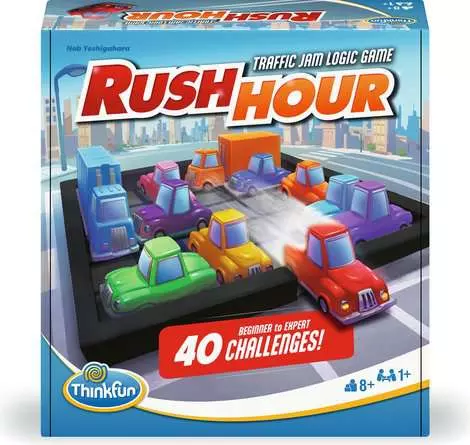

# Tucil3_13523086_13523088



## Brief Description
This project is a **Rush Hour Solver** application that solves Rush Hour puzzles using various search algorithms such as UCS, GBFS, A* and IDA while also providing 2 usable different heuristics to use. It provides a web interface for editing puzzles, uploading files, selecting algorithms, and visualizing the solution step by step.

## Requirements & Installation
- **Java JDK 17+** (for backend)
- **Node.js 18+ & npm** (for frontend)
- **VS Code** (recommended, optional)
- No external dependencies other than those in `package.json` and `pom.xml`.

## How to Compile & Run

### Backend (Java Spring Boot)
1. Go to the backend folder:
```bash
cd src/backend
```
2. Run the backend server:
```bash
.\mvnw.cmd spring-boot:run
```
### Frontend (Next.js/React)
1. Go to the frontend folder:
```bash
cd src/frontend
```
2. Install dependencies:
```bash
npm install
```
3. Start the frontend app:
```bash
npm run dev 
```

4. Open your browser at [http://localhost:3000](http://localhost:3000)

## How to Use

- **Puzzle Editor:** Create or edit Rush Hour puzzles via the "Puzzle Editor" tab.
- **Solver:** Upload a puzzle configuration file or paste it manually, select the algorithm, then click "Solve Puzzle".
- **Visualization:** View the solution steps visually and see search statistics.

## Author
- **13523086** – Bob Kunanda (bobkunanda@gmail.com)
- **13523088** – Aryo Bama Wiratama (13523088@std.stei.itb.ac.id)